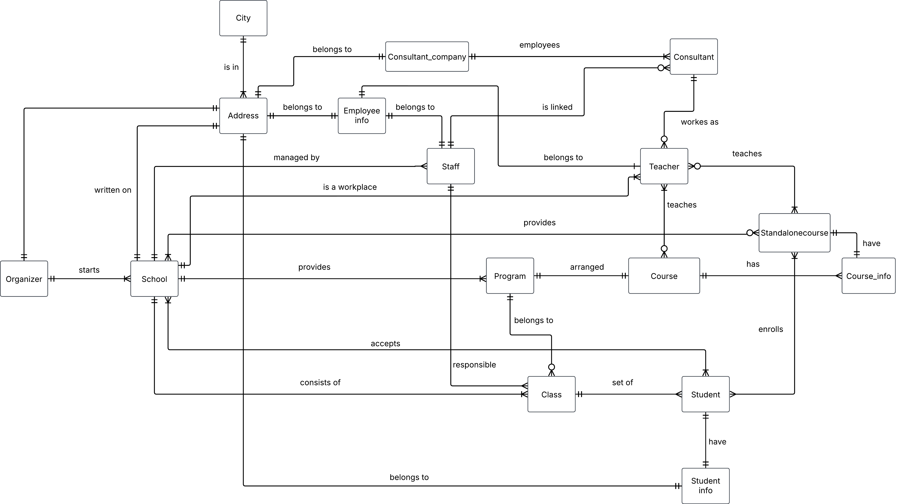
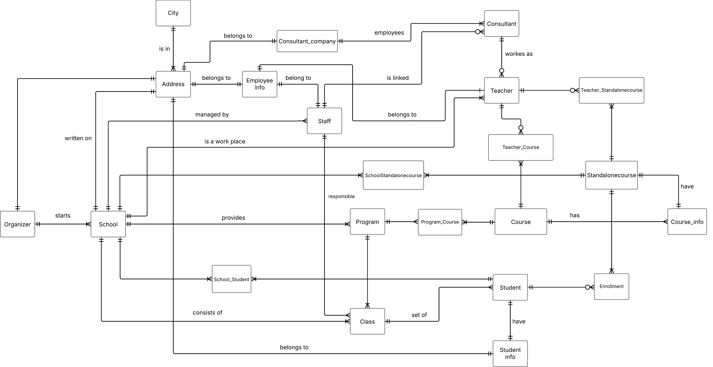

# Conceptual model

**Entities**
- School
- Organizer
- Program
- Course_schedule
- Standalonecourse
- Course_info
- Class
- Student
- Student info
- Teacher
- Staff
- Consultant
- Consultant_company
- Employee_info
- Address
- City

 

**Relationship Statement and label**
- an Organizer `starts` one or sevral schools, each School `belongs to` one and only one organizer.
- Each School `Provides` one or sevral programs, a Program `belong to` one or sevral schools.
- each Program `belongs to` zero, one or more classes,
each Class `create to ` one and only one program.
- a Program `arranged` sevral courses in course_schedule, each Course_schedula `is made for` one and only one program.
- a Course_schedule `has` sevral course_info, Course_info `belongs to` one and only one course_schedule.   
- a Class is  a `set of ` sevral students, Student can only `belong to` one and only one class.
- School `consists of` one or more classes, each Class `belongs to` one and only one school.
each Student `have` one and only one student information, Studen_info can only `belong to` one and only one student.
- a Address `belongs to` one and only one student_info, Student_info is `connected` to one and only one address. 
- a Address `is in` one and only one city, a city `contains` one and only one address.  
- a staff `work at` one and only one school, each School `managed by` one or more staffs.
- Employee_info `belongs to` one and only one staff, each Staff `typing in` one and only one information in empolyee_info.
- Consultant_company has one or more  `employees` as consultants, each Consultant `belongs to` one and only one consultant_company. 
- a Staff member `is linked` to zero, one or more consultants, a Consultant `corresponds` to one and only one staff.
- a Staff member may be `linked to` one or more teachers, every Teacher `must be` one and only one staff.  
- each School `provides` zero, one or more standalonecourses, Standalonecourse  is `available in` one or more schools.
- Teacher `teaches` in zero, one or more coursers in course_schedule, each  course in Course_schedule `shared with` one or more teachers.
- Teacher `teaches in` one or more standalonecourses, Standalonecourse `taught` by zero, one or more teachers.
- a school `is a workplace` for one or more techers, Teacher `work at` one and only one school.  

**Initial conceptual ERD**

 

**Conceptual ERD with composite entities**

***Entities***
- School
- Organizer
- Program
- School_program
- Course_schedule
- Course_info
- Teacher_Course_schedule
- Teacher
- Teacher_Standalonecourse
- Standalonecourse
- Enrollment
- Class
- School_Student
- Student
- Student_Info
- Address
- City
- Employee_info
- Staff
- Consultan
- Consultant_company

**Business rules**

- A program can exist in other school.
- When a program created a class automatic creates but don't need to have students.
- Class can only belong to one program.
- student can't be in sevral classes, only in one
- Standalonecourse can take student that not are in any classes.
- Staff can only belong to one school.
- Course_schedule can only belong to one program and a program can only have one course_schedule.
- Student can only writte one address, phone number and email.
- Employee info only contains address, salery and when they started and ended. 
- Teacher can only belong to one school.
- Educational management must be a employee, so he/she exist in staff. 
