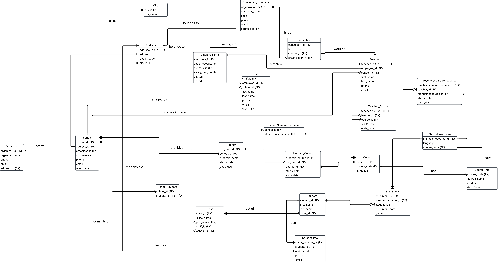

# Logical model

**Entity and attribute**

***Orginazer***
- orginazer_id (PK)
- organizer_name
- phone
- email
- address_id

***School***
- school_id (PK)
- address_id (FK)
- orginazer_id (FK)
- schoolname
- phone
- email
- open_date

***Address***
- address_id (PK)
- address
- postal_code
- city (FK)

***City***
- city_id (PK)
- city_name

***School_Student***
- school_id (FK)
- student_id (FK)
- composite primary key (school_id, student_id)

***Program***
- program_id (PK)
- school_id (FK)
- program_name
- starts_date
- ends_date

***Course_schedule***
- cours_id (PK)
- course_code (FK)
- starts_date
- ends_date

***Course_info***
- course_code (PK)
- course_name
- credits
- description

***Teacher***
- teacher_id (PK)
- consultant_id (FK)
- employee_id (FK)
- first_name
- last_name
- phone
- email

***Course_schedule***
- schedule_id (PK)
- teacher_id (FK)
- course_id (FK)
- starts_date
- ends_date

***Teacher_Standalonecourse***
- teacher_standalonecourse_id (PK)
- teacher_id (FK)
- standalonecourse_id (FK)
- starts_date
- ends_date

***Standalonecourse***
- standalonecourse_id (PK)
- Language
- course_code (FK)

***SchoolStandalonecourse***
- school_id (FK)
- standalonecourse_id (FK)
- composite primary key (school_id, standalonecourse_id)

***Enrollment***
- enrollment_id (PK)
- standalonecourse_id (FK)
- student_id (FK)
- enrollment_date
- grade

***Student***
- student_id (PK)
- class_id (FK)
- first_name
- last_name

***Student_info***
- social_security_nr (PK)
- student_id (FK)
- address_id (FK)
- phone
- email

***Class***
- class_id (PK)
- program_id (FK)
- school_id (FK)
- class_name

***Staff***
- staff_id (PK)
- school_id (FK)
- employee_id (FK)
- first_name
- last_name
- phone
- email
- work_title
- roll

***Employee_info***
- employee_id (PK)
- social_security_nr  
- address_id (FK)
- salary
- started
- ended

***Consultant***
- consultant_id (PK)
- fee_per_hour
- work title
- organization_nr (FK)

***Consultan_company***
- organization_nr (PK)
- address_id (FK)
- company_name
- f-tax
- phone
- email

**Logical model ERD**

**Relational schema notation**
- Organizer (<u>organizer_id</u>, organizer_name, phone, email, address_id, FK address_id -> Address)

- School (<u>school_id</u>, address_id, schoolname, phone, email, organizer_id, open_date, FK: address_id -> Address, Fk: organizer_id -> Organizer)

- Program (<u>program_id</u>, program_name, nr_active)

- Class (<u>class_id</u>, management_id, class_name)

- Student (<u>student_id</u>, first_name, last_name, class_id, FK: class_id -> Class)

- Student_info (<u>social_security_nr</u>, student_id, address_id, phone, email, FK: student_id -> Student, FK: address_id -> Address)

- Address (<u>address_id</u>, address, postal_code, city_id, FK: city_id -> City)

- City (<u>city_id</u>, city_name)

- Course_info (<u>course_code</u>, course_name, credits, description)

- Course (<u>course_id</u>, course_code, FK: course_code -> Course_info)

- Standalonecourse (<u>standalonecourse_id</u>, starts_date, ends_date, course_code, FK course_code -> Course_info)

- Teacher (<u>teacher</u>, staff_id, FK: staff_id -> Staff)

- Staff (<u>staff_id</u>, school_id, first_name, last_name, phone, email, work_title, roll, FK: school_id -> School)

- Consultant (<u>consultant_id</u>, fee_per_hour, organizer_nr, staff_id, FK organizer_nr -> Consultant_company, FK: staff_id -> Staff)

Consultant_company (<u>organization_nr</u>, company_name, f_tax, phone, email, address_id, FK: address_id -> Addrsss)

Employee_info (<u>social_security_nr</u>, staff_id, address_id, salery_per_moth, started, FK staff_id -> Staff, FK: address_id -> Address)

EducationalManagement (<u>management_id</u>, staff_id, FK: class_id -> Class, FK: staff_id -> Staff)

SchoolProgramClass (<u>school_id</u>, <u>program_id</u>, <u>class_id</u>, nr_student, starts_date, ends_date, FK: school_id -> School, FK: program_id -> Program, FK: class_id -> Class)

Enrollment (<u>standalonecourse_id</u>, <u>student_id</u>, <u>shcool_id</u>, FK: standalonecourse_id -> Standalonecourse, FK: student_id -> Student, FK: school_id -> School)

CourseProgram (<u>course_id</U>, program_id, starts_date, ends_date, FK program_id -> Program)

TeacherAssignment (<u>teacher_id</u>, <u>standalonecourse_id</u>, <u>school_id</u>, FK: teacher_id -> Teacher, FK: standalonecourse_id -> Standalonecourse, FK: school_id -> School)

TeacherCourse (<u>teacher_id</u>, course_id, FK: course_id -> Course)

**Function dependency**

- organizer_id -> (organizer_name, phone, email, address_id)

- school_id -> (address_id, schoolname, phone, email, organizer_id, open_date)

- program_id -> (program_name, nr_active)

- class_id -> (management_id, class_name)

- student_id -> (first_name, last_name, class_id)

- social_security_nr -> (student_id, address_id, phone, email)

- standalonecourse_id -> (starts_date, ends_date, course_code)

- course_id -> course_code

- teacher_id -> course_id

- teacher_id -> staff_id

- staff_id -> (school_id, first_name, last_name, phone, email, work_title, roll)

- consultant_id -> (fee_per_hour, organization_nr, staff_id)

- organization_nr -> (company_name, f_tax, phone, email, address_id)

- social_security_nr -> (staff_id, address_id, salery_per_month, started)

- management_id -> (staff_id)

- address_id -> (address, postal_code, city_id)

- city_id -> city_name

- (school_id, program_id, class_id) -> (school_id, program_id, class_id, nr_student, starts_date, ends_date)

**Trivially**
- (standalonecours_id, student_id, school_id) -> (standalonecourse_id, student_id, school_id)

- (techer_id, standalonecourse_id, school_id) -> (teacher_id, standalonecourse_id, school_id)

