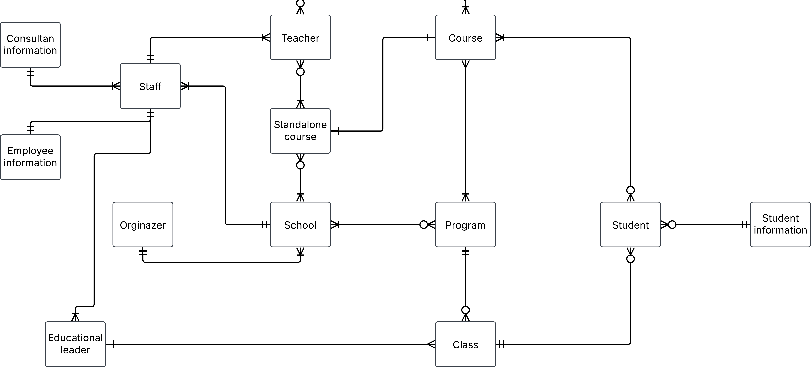
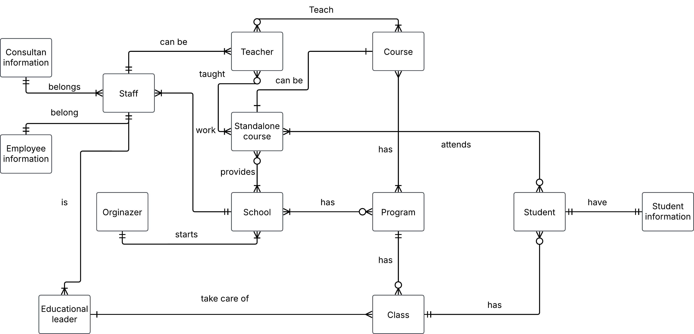

# Building a database for the yrkeshögskolan yrkesCO

**Requirementsspecification**
- about students, first name, last name, social security number, email
- Teacher can be consultants
- The plan to hire teacher permanent (BONUS)
- Educational leaders and their personal data
- Educational leader is charge of 3 classes
- Courses with name, course code, number of credits, short description of the course
- Program has a number of courses attached to it
- A program is granted in three rounds, i.e. there are 3 classes
- There are also standalone courses (BONUS)
- Consultants, their company, company information such as corporate registraion number, F-tax, address, how much they charge per hour
- YrkesCo has two facilities, one in Gothenburg and one in Stockholm, in the future they may expand to more locations (BONUS)

## Conceptual model

**Entities**
- School
- Orginazer
- Program
- Course
- Standalone course
- Class
- Student
- Student infomation
- Educational leader
- Teacher
- Independent course
- Staff
- Staff information
- Consultant information

**Initial conceptual ERD**

 

**Relationship Statement and label**

- An Orginazer `starts` one or sevral Schools, each schools `belong` to just one Orginazer.
- Each School has zero, one or many Programs, and Program `exists` in one or sevral Schools.
- A School `provides` zero, one or sevral Standalone courses, and a Standalone course is `available` in one or sevral Schools.
- School `has` one or sevral staff members, and Staff member `work` at one school.
- A Standalone course is `taught` by zero, one or sevral teachers, A Teacher `teach` zero, one or more standalone courses. 
- Teacher `teach` in one or more courses, a Course be `taught` by zero, one or sevral teachers.
- A Class `has` a program that it follows, Program `has` zero, one or more classes that are followed by.
- Program has `sevral` courses, a Course `exists` in one or sevral programs.
- Each Educational leader `is` one and only one staff, a Staff `can` be one or more educational leader.
- Each Educational leader `take care of` sevral classes, a Class `have` zero or one educational leader.
- A class `has` zero, one or sevral students, Student are `placed` in one and only one class
- Each Student `have` one and only one information, Student information `have` only one student.
- A Student `attends` to one or sevral courses, every Course, there are students.
- Employee information `belong` to one and only one staff member, A staff `have` one and only one employee information.
- Consultan information `belongs` to one or sevral staff member, A Staff member `have` only one cosultan information attached to it.
- A Staff member `can be` one or more teacher, A Teacher `can` only be sign in as one and only one staff member.
- Standalone course `can` be a course in the program, a Course in the program `can` be a standalone course

 

