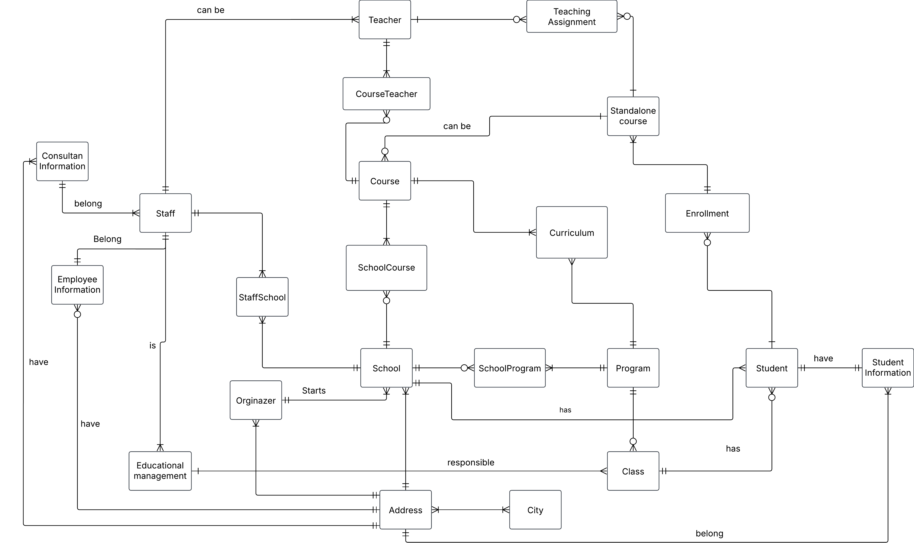

# Building a database for the yrkeshögskolan yrkesCO

**Requirementsspecification**
- about students, first name, last name, social security number, email
- Teacher can be consultants
- The plan to hire teacher permanent (BONUS)
- Educational leaders and their personal data
- Educational leader is charge of 3 classes
- Courses with name, course code, number of credits, short description of the course
- Program has a number of courses attached to it
- A program is granted in three rounds, i.e. there are 3 classes
- There are also standalone courses (BONUS)
- Consultants, their company, company information such as corporate registraion number, F-tax, address, how much they charge per hour
- YrkesCo has two facilities, one in Gothenburg and one in Stockholm, in the future they may expand to more locations (BONUS)

## Conceptual model

**Entities**
- School
- Orginazer
- Program
- Course
- Standalone course
- Class
- Student
- Student infomation
- Educational leader
- Teacher
- Independent course
- Staff
- Staff information
- Consultant information

**Initial conceptual ERD**

 

**Relationship Statement and label**

- An Orginazer `starts` one or sevral Schools, each schools `belong` to just one Orginazer.
- Each School has zero, one or many Programs, and Program `exists` in one or sevral Schools.
- A School `provides` zero, one or sevral courses, and a Course is `available` in one or sevral Schools.
- School `has` one or sevral staff members, and Staff member `work` at one school.
- A Standalone course is `taught` by zero, one or sevral teachers, A Teacher `teach` zero, one or more standalone courses. 
- Teacher `teach` in one or more courses, a Course be `taught` by zero, one or sevral teachers.
- A Class `has` a program that it follows, Program `has` zero, one or more classes that are followed by.
- Program has `sevral` courses, a Course `exists` in one or sevral programs.
- Each Educational leader `is` one and only one staff, a Staff `can` be one or more educational leader.
- Each Educational leader is `responsible` for sevral classes, a Class `have` zero or one educational leader.
- A class `has` zero, one or sevral students, Student are `placed` in one and only one class
- Each Student `have` one and only one information, Student information `have` only one student.
- A Student `attends` to one or sevral standalone courses, every Standalone Course `there will be` zero or sevral students. 
- Employee information `belong` to one and only one staff member, A staff `have` one and only one employee information.
- Consultan information can `belong` to one or sevral staff member, A Staff member `have` only one cosultan information attached to it.
- A Staff member `can be` one or more teacher, A Teacher `can` only be sign in as one and only one staff member.
- Standalone course `can` be a course in the program, a Course in the program `can` be a standalone course

 

 

**conceptual ERD with composite entities**

***Entities and composite entities***
- School
- Orginazer
- SchoolProgram
- Program
- Curriculum
- Course
- SchoolCourse
- CourseTeacher
- Teacher
- Teaching_Assignment
- Standalone_course
- Enrollment
- Student
- Student_Information
- Address
- City
- Educational_management
- Staff
- Employee_Information
- Consultan_Information

***Business rules***
- Each student may only have one registered address
- A student can only belong to one school
- Each employeed may only have one registered address
---

## Logical model

**Entity and attribute**

***Orginazer***
- orginazer_id (PK)
- phone
- email

***School***
- school_id (PK)
- address_id (FK)
- orginazer_id (FK)
- school_name
- phone
- email

***Address***
- address_id (PK)
- city (FK)
- address
- postcode

***City***
- city_id (PK)
- city

***SchoolProgram***
- composite primary key (school_id, program_id)
- school_id (FK)
- program_id (FK)

***Program***
- program_id (PK)
- program_name
- start_date
- end_date

***Curriculum***
- composite primary key (program_id, course_id)
- program_id (FK)
- course_id (FK)

***Course***
- course_id (PK)
- course_name
- cours_code
- credits
- description
- start_date
- end_date

***CourseTeache***
- composite primary key (course_id, teacher_id)
- course_id (FK)
- teacher_id (FK)

***Teacher***
- teacher_id (PK)
- first_name
- last_name

***TeacherAssignment***
- compoiste primary key (teacher_id, standalone_course_id)
- teacher_id (FK)
- standalone_course (FK)

***Standalone_course***
- standalone_course_id (PK)
- standalone_course_name
- course_code
- credits
- description
- start_date
- end_date

***Enrollment***
- composite primary key (standalone_course_id, student_id)
- standalone_course_id (FK)
- student_id (FK)

***Student***
- student_id (PK)
- student_information (FK)
- class_id (FK)
- first_name
- last_name

***Student_information***
- student_social_securit_number (PK)
- address_id (FK)
- school_id (FK)
- phone
- email
- password

***Class***
- class_id (PK)
- program_id (FK)
- class_name
- amount

***Educational_leader***
- educational_leader_id (PK)
- class_id (FK)
- staff_id (FK)
- first_name
- last_name

***Staff***
- staff_id (PK)
- first_name
- last_name

***Employee_information***
- social_security_number (PK)
- staff_id (FK)
- address_id (FK)
- phone
- email

***Consultan_information***
- consultan_id (PK)
- address_id (FK)
- company
- company_information
- organiztion_number
- f-tax

***StaffSchool***
- composite primary key (staff_id, school_id)
- staff_id (FK)
- school_id (FK)